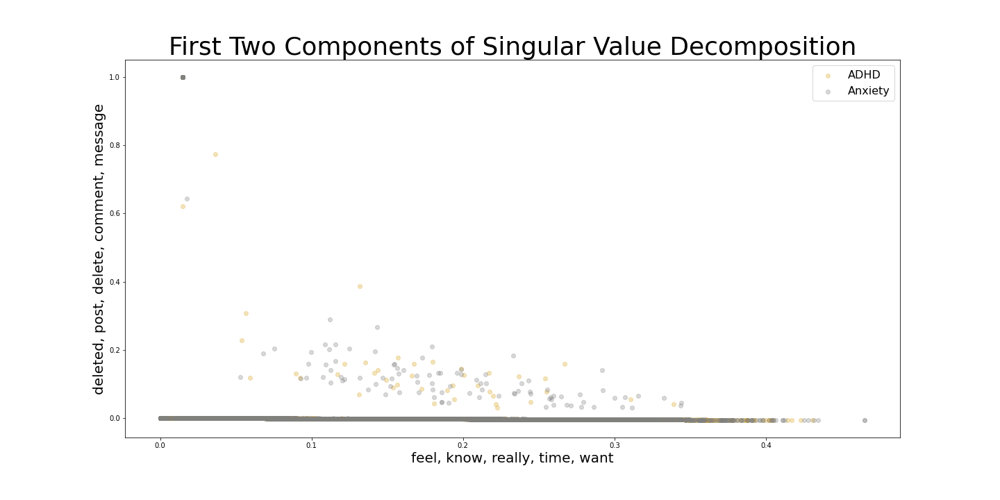
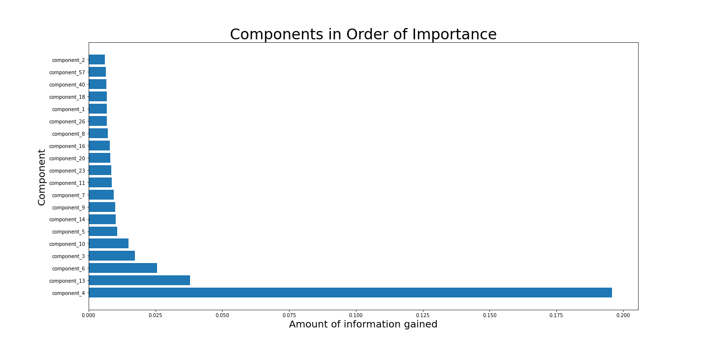
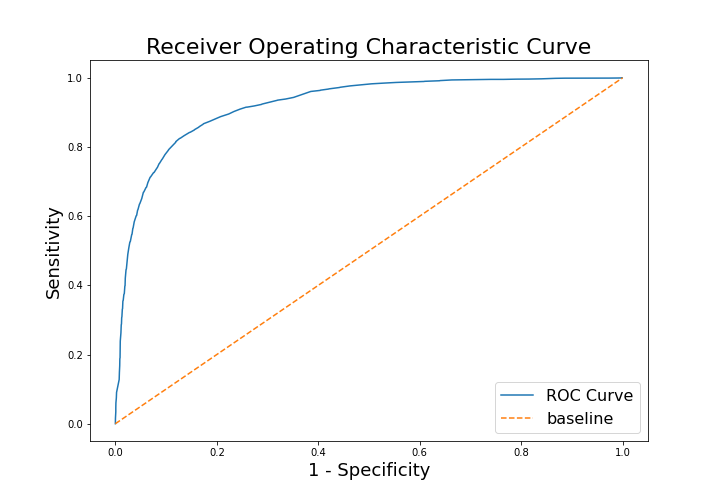

# Classification of the /r/ADHD and /r/Anxiety SubReddits

## Executive Summary

This analysis uses data from 2 SubReddits: /r/ADHD and /r/Anxiety to train a Natural Language Processing (NLP) classifier on which subreddit a given post comes from. The purpose was to see if the language used in the two subreddits is different, and if so, how, since ADHD and Generalized Anxiety Disorder have many overlapping symptoms and ADHD is often misdiagnosed as a result. I start off by defining my problem statement. I then provide some background information, followed by the results of my analysis.

## Problem Statement

Attention deficit hyperactivity disorder (ADHD) is one of the most frequently diagnosed disorders in children, yet there is much disagreement around its correct diagnosis [(Ford-Jones, 2015).](https://www.ncbi.nlm.nih.gov/pmc/articles/PMC4443828/) According to the Anxiety and Depression Association of America (ADAA), about **half** of adults with ADHD also suffer from an anxiety disorder [(ADAA, 2019).](https://adaa.org/understanding-anxiety/related-illnesses/other-related-conditions/adult-adhd) Overlapping symptoms of comorbid psychiatric conditions often complicate an already difficult diagnosis. Fortunately, there are online communities where users gather to share their experiences, ask questions, and support one another. Social media data has been shown to be an untapped resource for knowledge on mental illnesses. For example, Twitter has been used to create classifiers that recognize depression in users [(De Choudhury et al., 2013).](https://www.microsoft.com/en-us/research/wp-content/uploads/2016/02/icwsm_13.pdf) Two such untapped resources exist on Reddit, in the /r/ADHD and /r/Anxiety subreddits. I believe that this analysis may be useful in assisting stakeholders to compare and contrast ADHD and Anxiety, identifying various overlaps and differences between the two groups. Some interested stakeholders might be healthcare professionals, diagnosed individuals, or even undiagnosed individuals who have loved ones suffering from either ADHD, anxiety, or both. 

## Background 

Reddit is a social media network where registered users can create posts to a broader community. Posts are hosted in topic-specific forums, called subreddits, which are created by users for anyone interested in that topic. There are over 1.2 million subreddits, ranging from sports, to politics, and everything in between. Users can join any number of subreddits and participate in discussions. The ADHD subreddit has nearly 400,000 subscribers and the official description reads, "A place where people with ADHD and their loved ones can interact with each other exchanging stories, struggles, and strategies. Weekly threads to plan and notice the positive in our lives. Many of the 300k+ users express they 'feel at home' and 'finally found a place where people understand them'." The Anxiety subreddit has 245,000 subscribers and the official description reads, "Discussion and support for sufferers and loved ones of any anxiety disorder." 

## Analysis

To download the posts from the two subreddits, I used the PushShift API. I downloaded 20,000 posts from each subreddit (40,000 total). I then cleaned the data by removing URLs and non-letter characters (e.g. slashes, line breaks, etc.). After all the cleaning, I ended up with just over 38,000 posts, with a 48-52 split between posts from the ADHD and Anxiety subreddits, respectively.

I then engaged in some Exploratory Data Analysis (EDA). One of the highlights from the EDA include the insight that posts from the ADHD subreddit tend to be shorter than those from the Anxiety subreddit, even though the averages for both are 162 words. The picture below shows the distribution of the length of posts from the two subreddits. 

 

As we can see, both distributions are skewed to the right, with the vast majority of posts being under 1000 words, and only a handful having more than that. 

---

#### Below are some of the most commonly used and interesting words in the two subreddits (after cleaning):

| ADHD | Anxiety |
| ---- | ------- |
| Feel: 60% | Feel: 91% |
| Time: 58% | Know: 65% |
| Know: 55% | Time: 52% |
| Things: 44% | Want: 42% |
| Work: 42% | People: 39% |
| People: 24% | Think: 34% |

It's no surprise that two of the most frequently used words in the ADHD subreddit are 'time' and 'feel,' since time management is one of the biggest struggles for those with ADHD. Interestingly, time is the third most commonly used word in the Anxiety subreddit, which highlights the issue of overlap mentioned in the problem statement. However, the word feel is way more common in the Anxiety subreddit, with 91% of posts containing the word at least once. In fact, looking at the top 20 terms in each subreddit, we see that 14 of them overlap, as shown in the list below:

  * time, feel, know, work, things, day, want, life, people, going, got, think, need, help

---
### Natural Language Processing

Next, I moved onto some more advanced natural language processing (NLP). I add some custom stop words that aren't included in the default SciKit-Learn library (stop words are very common words that do not convey much meaning, which we explicitly tell our models to ignore). I used both CountVectorizer and TF-IDF (term frequency-inverse document frequency). 

The difference between the two is that, instead of simply counting the frequencies of our words, TF-IDF tries to distinguish their importance by assigning weights proportional to the number of times a word appear in a specific post, offset by the number of posts that use that word. For both, though, I set a minimum document frequency of 5 (i.e. words must be in at least 5 posts to be included). I also set the max_df to .9, meaning that words that appear in more than 90% of posts will be left out because they are too common. Regardless, the TF-IDF algorithm weights very common words accordingly.

I also conducted some latent semantic analysis (LSA) using singular value decomposition (SVD). LSA using SVD is similar to principal components analysis (PCA), but does not center the data. In Python, computing the SVD is similar to any other sklearn preprocessing method, where we fit and transform our data. Normally, we would want to split our data into training and testing sets before running our decomposition. However, I'm not worried too about the variance of our validation data impacting our components. As we'll see later, the results do not differ much between models. 

### Latent Semantic Analysis using Singular Value Decomposition

I only included the top 5 words in each component's axis label, to no clutter the plot. Component one seems to be regarding the time management issue that I previously touched upon. From reading hundreds of posts, it makes sense that those with ADHD _know_ that they have work to do, and _really want_ to do it, but struggle with managing their _time_ and _feel_ bad for not being able to handle the little, everyday things that other people take for granted. Component 2 seems to be regarding the deletion of social media. In particular, the word **deleted** is accounting for almost 100% of the entire component!

The single gray dot at the top near 1 is the word **deleted**, and is a huge outlier. Thus, the axes labels of the top 5 words loaded in each component is a bit misleading for component 2, since the rest of the words account for less than .0001%, whereas for component 1, the distribution was much more even. As such, most of the values end up as a horizontal line on the x axis. From whatever little variation there is, there isn't a good separation of our subreddits. Below is the same plot for the second and third components. 

For the second and third components there seems to be a bit more separation, but there is still a lot of overlap, which is, again, not surprising due to component two being so heavily dominated by just one word: deleted. However, when I plotted components 1 and 3 together, things looked very different. 

Now we see a much more dispersed plot. Some words load positively into the component, some load negatively, but there is no distinct separation between the 2 subreddits. Latent Semantic Analysis, and natural language processing more broadly, is one of the areas of data science that is at times more of an art, than a science. These are just the first three components out of 300! Of course, I can't possibly go through all of them, but I wanted to show this as a proof of concept. Speaking of which, once models are fit using components, their relative importance can be extracted. Below, I show the top 20 most important components in terms of providing information gain for the random forest model using SVD. 

Interestingly, component 4, which I hadn't touched upon before, but discuss in my Preprocessing notebook, provides the most information gain. Component 4 is a medication-related topic, where the top 10 words are:

- medication, meds, adderall, taking, diagnosed, vyvanse, doctor, work, prescribed, dose

Components 1, 2, and 3 were further down the list, but at least they were still in the top 20. Regardless, because these components are not as intuitive to look at as the words themselves, and time-consuming to work with, I will reran the models without using singular value decomposition to provide this same graph for the most important words in the random forest model with SVD.

Here we can see that anxious, panic and diagnose are the top 3 important features in our random forest model. This is interesting, because these were not the words we focused on during the EDA process. However, the rest of the words are those we expect, such as those related to medication and emotions.

---
### Logistic Regression and Random Forest Modeling

I tested out logistic regression and random forests in my modeling. If you're unfamiliar with Random Forests, the name comes from its relation to Decision Trees, which is essentially a classifier based on splitting up the data using many if-statements. Random Forests classification uses many (i.e. bagged) decision trees, bootstraps them (i.e. sampling with replacement), and modifies the tree learning algorithm so that at each split in the learning process, a random subset of features (in this case words) is used.

| Model Comparison                   | Train Score | Test Score |
|------------------------------------|----------------|---------------|
| Logistic Regression with SVD    | 87%            | 86%           |
| Random Forest with SVD             | 99%            | 82%           |
| Logistic Regression TF-IDF Only | 91%            | 87%           |
| Random Forest TF-IDF Only          | 99%            | 85%           |

Surprisingly, logistic regression performed well. On the training set, the accuracy rate was 87% and on the test set it was 86% (for the model using SVD). The Random Forests Classifier overfit on the training set, getting an accuracy of over 99% on both the regular and SVD models. However, the SVD random forest model got 82% on the test set, compared to 85% for the non-SVD model. Regardless, all these models performed much better than the baseline, which was 52%. However, accuracy is not the only metric for evaluating models. Below, I show the confusion matrix for my best model: logistic regression without SVD. 

The logistic regression model's specificity (i.e. true negative rate) is also 87%, meaning that of the posts that were actually from the anxiety subreddit, 87% were correctly classified. The logistic regression model's sensitivity (i.e. true positive rate) is also 87%, meaning that of the posts that were actually from the ADHD subreddit, 87% were correctly classified. To better visualize this tradeoff between sensitivity and specificity, I will graph the receiver operating characteristic (ROC) curves for each model below.

#### AUC-ROC Curve for Logistic Regression Model

#### AUC-ROC Curve for Random Forests Model

As we can see, both of the AUC-ROC curves are quite similar, although the one for the logistic regression model looks a bit smoother. Regardless, it's ROC-AUC score was .94, compared with .92 for the random forests model. As such, if I had to pick one, I would choose the logistic regression model for my final "production" model. 

## Conclusion

This preliminary and exploratory analysis used data from 2 SubReddits: /r/ADHD and /r/Anxiety to train two Natural Language Processing (NLP) classifiers on which subreddit a given post came from: Logistic Regression and Random Forest. Although both models performed well, logistic regression performed slightly better. Given it's vastly faster compute time, and the fact that it is the more parsimonous of the two, I would choose the logistic regression model for my final "production" model. 

It's a fine balancing act deciding which words to remove and which to keep. In the future I would like to test out the removal of more words, as well as explore bi-grams and tri-grams (e.g. panic attack, generalized anxiety disorder, social anxiety, health anxiety, etc.). Also, I would like to test other models as well, such as gradient boosting and K-Nearest Neighbors. Ultimately, this is not a causal model, nor am I a medical expert. My aim has simply been to start to shed light on, and extend to outsiders, the dialogues that these hundreds of thousands of Reddit users have been engaging in with one another. If even one person feels less alone because of this project, or one medical professional more informed, I would consider this project a success.
